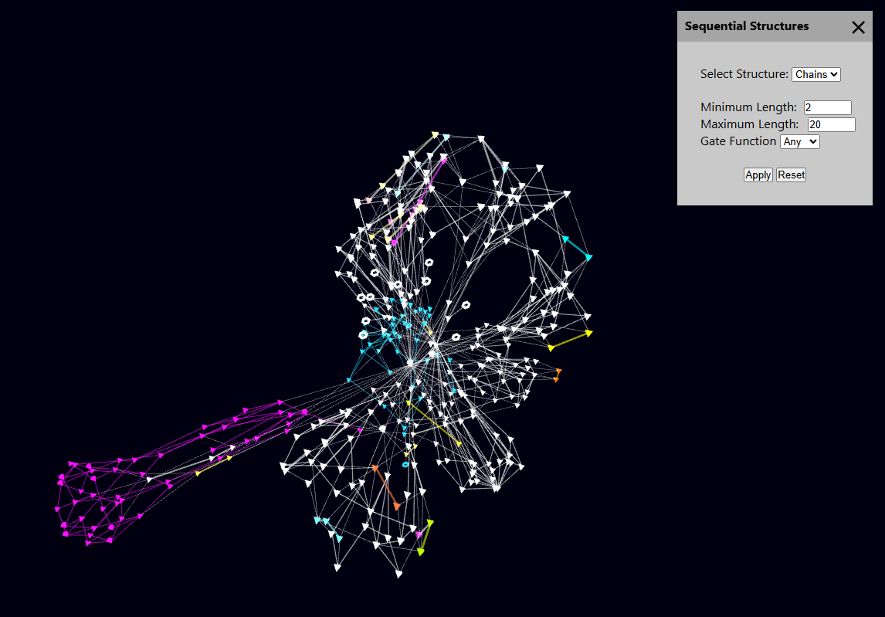

# RE Graph View  
### 3D Graph-Based Reverse Engineering for Digital Circuits

Live Demo:  
https://petro-byte.github.io/re-graph-view

## Overview

RE Graph View is a browser-based interactive tool for reverse engineering digital circuits through 3D graph visualization and structural analysis.

It transforms gate-level netlists into dynamic graph representations that enable intuitive exploration of complex circuit structures.

## Cybersecurity Context

Modern hardware systems can contain hidden malicious modifications such as hardware Trojans. These are often deeply embedded in otherwise legitimate logic and are difficult to detect using traditional inspection methods.

A key observation in hardware security is that malicious circuitry frequently introduces **structural irregularities**:

- Unusual feedback loops  
- Redundant or obfuscated logic chains  
- Suspicious fan-out / fan-in patterns  
- Small subgraphs with atypical connectivity  

Rather than relying purely on functional simulation, this tool focuses on **structural analysis**, enabling analysts to visually inspect and isolate such patterns.

The goal is not full automation, but to support **human-in-the-loop reverse engineering workflows**, where visualization and structure-aware exploration significantly reduce analysis complexity.

## Scientific and Methodological Background

The project is grounded in graph theory and network science applied to digital circuit analysis.

Gate-level netlists are interpreted as directed graphs where:

- Nodes represent logic gates  
- Edges represent signal propagation  

On top of this representation, clustering and partitioning metadata can be incorporated from external analysis pipelines, including:

- Louvain  
- Leiden  
- Markov Clustering (MCL)  
- Nested Stochastic Block Models (NSBM)  

These are **not computed within the application by default**, but are instead **parsed from enriched netlist data** and visualized interactively.

This design reflects a realistic workflow where heavy analysis is performed offline, while the application focuses on **exploration and interpretation**.

## Computed vs. Data-Driven Clustering

The application distinguishes between two types of clustering:

### Data-Driven Clustering
- Louvain, Leiden, MCL and NSBM results are read from node attributes in the netlist
- Supports multi-run and multi-resolution data
- Intended for integration with external analysis pipelines

### Computed Clustering (Louvain)
- A browser-based Louvain variant is implemented as a standalone feature
- Can be applied to any loaded graph without precomputed metadata
- Provides immediate structural grouping for exploratory analysis

This hybrid approach allows both:
- integration with research-grade preprocessing pipelines  
- and lightweight, interactive clustering directly in the browser  

Future work may extend this to additional algorithms such as Leiden or MCL.

## Structural Analysis

A core focus of the tool is the detection of structural patterns:

- Chains (linear sequences of gates)
- Trees (fan-out / hierarchical structures)
- Loops (cyclic dependencies)

These structures are particularly relevant in security contexts:

- Hardware Trojans often introduce **trigger loops**
- Obfuscation logic may appear as **deep or irregular chains**
- Payload circuits can form **distinct structural subgraphs**

By explicitly detecting and highlighting these patterns, the tool enables targeted inspection of potentially suspicious regions.

## Vulnerability and Suspiciousness Analysis

The tool supports visualization of precomputed suspiciousness metrics:

- Minimum suspiciousness  
- Mean suspiciousness  
- Maximum suspiciousness  

These values are provided via the netlist and visualized as heatmaps.

The application itself does not compute these metrics, but serves as a **visual analysis layer** for interpreting them in structural context.

## Core Features

### Data Handling
- Import netlists (JSON)
- Import gate libraries
- Load predefined sample datasets

### Clustering and Partitioning
- Visualization of Louvain, Leiden, MCL, NSBM (data-driven)
- Partition highlighting
- Computed Louvain clustering (browser-based)

### Structural Analysis
- Chain detection
- Tree detection
- Loop detection

### Visualization
- 3D force-directed graph rendering
- Interactive navigation (zoom, rotate, focus)
- Dynamic coloring (clusters, structures, suspiciousness)

### Graph Manipulation
- Cluster-based layout separation
- Adjustable layout parameters
- Reset and filtering options

### Export
- Export graph data
- Export netlists
- Export gate libraries

## Usage

1. Load a netlist via the Import menu  
2. Optionally load or apply a gate library  
3. Use Analysis tools:
   - Cluster visualization (data-driven or computed)
   - Sequential structure detection
   - Layout adjustments  
4. Explore the graph interactively  

## Project Structure

src/
- main.js            Entry point  
- init.js            Initialization and data pipeline  
- layout.js          Graph layout configuration  
- cluster.js         Clustering and partition logic  
- structures.js      Structure detection  
- setters.js         Reset and color handling  
- utils.js           Helper functions  
- visuals.js         Rendering logic  

The application is fully client-side and runs entirely in the browser.

## Technology Stack

- JavaScript (Vanilla)
- Three.js
- d3-force-3d
- HTML5 / CSS

## Relevance

This project demonstrates:

- Graph-based reverse engineering of digital systems  
- Structural analysis as a tool for hardware security  
- Integration of external analysis pipelines with interactive visualization  
- Browser-based exploratory data analysis  

It is particularly relevant in the context of hardware security, where understanding structural properties is essential for identifying hidden or malicious functionality.

## Author

Luka Petrovic